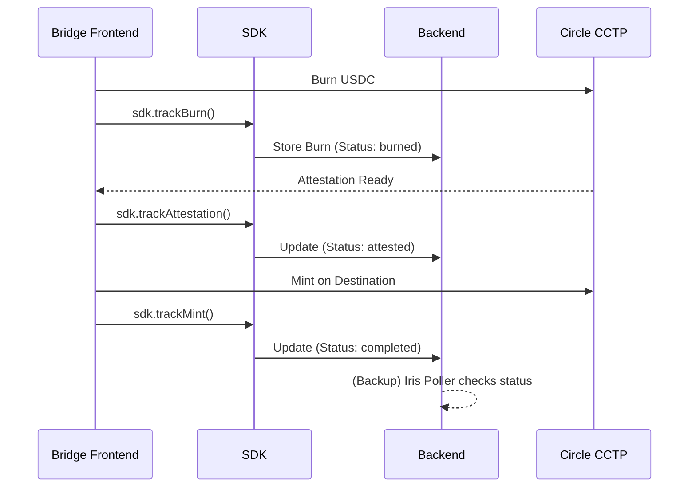

# 🌉 bridge-id-sdk

[](https://www.npmjs.com/package/bridge-id-sdk)
[](https://opensource.org/licenses/MIT)
[](https://developers.circle.com/stablecoins/cctp-getting-started)

Attribution and analytics SDK for Circle CCTP bridge integrators.

Gives every bridge a unique ID, tracks the full burn→attestation→mint lifecycle, and exposes
transaction history and analytics that works with any CCTP-compatible bridge.

---

## Source Code

- **SDK Repository**: [github.com/heyeren2/bridge-id-sdk](https://github.com/heyeren2/bridge-id-sdk)
- **Backend Template**: [github.com/heyeren2/bridge-id-backend-template](https://github.com/heyeren2/bridge-id-backend-template)

---

## How It Works



Your analytics backend stores these steps, allowing you to show a clean **Activity** history with statuses across 
multiple chains. A backup poller in the backend also checks the Iris API every 2 minutes for any missed updates.

---

## Installation

```bash
npm install bridge-id-sdk
```

---

## Step 1: Generate Your Bridge ID

Run this **once** when setting up. This unique ID links all your bridge transactions to your analytics backend.
Pass your **Project Name** and **Fee Recipient** address to generate a unique, deterministic ID.

**From your project folder** (where `bridge-id-sdk` is installed):
```bash
npx bridgeidsdk --name "MyBridge" --address "0xYOUR_FEE_RECIPIENT_ADDRESS"
```

Output:
```
✅ Your Bridge ID:

   mybridge_a3f9c2

Add this to your .env:

   VITE_BRIDGE_ID=mybridge_a3f9c2
```

> ⚠️ **Never change this ID.** All historical transactions are permanently linked to it.

---

## Step 2: Initialize the SDK

```typescript
import { BridgeAnalytics } from "bridge-id-sdk"

const sdk = new BridgeAnalytics({
  bridgeId: import.meta.env.VITE_BRIDGE_ID,
  apiUrl: "https://your-analytics-backend.xyz",

  // Optional — pass your own RPC URLs for status checking
  rpcUrls: {
    sepolia: import.meta.env.VITE_SEPOLIA_RPC,
    base:    import.meta.env.VITE_BASE_RPC,
    arc:     import.meta.env.VITE_ARC_RPC,
  }
})
```

---

## Step 3: Track Bridge Lifecycle

Call these as the bridge transaction progresses. In your frontend, use these inside your "status update" callbacks.

### Track the Burn
Call this as soon as the source chain transaction is confirmed.

```typescript
await sdk.trackBurn({
  burnTxHash: "0x...",
  wallet: userAddress,
  amount: "100.00",
  sourceChain: "sepolia",
  destinationChain: "base",
})
```

### Track the Attestation
Call this when the Circle attestation is fetched.

```typescript
await sdk.trackAttestation({
  burnTxHash: "0x...",
  success: true, // or false if it failed
})
```

### Track the Mint
Call this once the destination chain transaction is confirmed.

```typescript
await sdk.trackMint({
  burnTxHash: "0x...",
  mintTxHash: "0x...", // required if success is true
  success: true,
})
```

---

## Step 4: Check Transaction Status

Use this to show real-time bridge progress to your users. The SDK checks both your backend and on-chain for accuracy.

```typescript
const status = await sdk.getStatus("0xBURN_TX_HASH")

// status.status is one of:
//   "burned"             — burn confirmed, waiting for attestation
//   "attested"           — Circle signed it, ready to mint
//   "attestation_failed" — Circle could not attest the burn
//   "mint_failed"        — transaction failed on destination (manual mode)
//   "completed"          — bridge cycle finished successfully
//   "not_found"          — transaction not tracked or recognized

if (status.status === "attested") {
  // Pass these to CCTP's receiveMessage() on the destination chain
  console.log("Ready to mint:", status.messageBytes, status.attestation)
}
```

---

## Step 5: Fetch Analytics & History

### User Activity
A flattened list of transactions for a specific user, perfect for an "Activity" tab.

```typescript
const activity = await sdk.getUserActivity(walletAddress)
```

### Transaction Search
Filter/search specifically for your bridge transactions.

```typescript
const txs = await sdk.getTransactions({
  wallet: userAddress, // or "all"
  limit: 20,
})
```

---

## Error Handling

All SDK methods throw a `BridgeError` on failure.

```typescript
import { BridgeError } from "bridge-id-sdk"

try {
  await sdk.trackBurn({ ... })
} catch (err) {
  if (err instanceof BridgeError) {
    console.error(`Error Code: ${err.code}`, err.message)
  }
}
```

| Code            | When it happens                                      |
|-----------------|------------------------------------------------------|
| `INVALID_INPUT` | Bad tx hash, wallet address, amount, or missing field |
| `NETWORK_ERROR` | RPC call or backend request failed                   |
| `NOT_FOUND`     | Transaction not found in backend or on-chain         |
| `CONFIG_ERROR`  | Missing `bridgeId` or `apiUrl` on SDK init           |

---

## Backend

This SDK requires a running analytics backend to store and serve transaction data.
We provide a ready-to-deploy template with Express, Drizzle ORM, and Neon (PostgreSQL).

**Quick start:**
```bash
git clone https://github.com/heyeren2/bridge-id-backend-template.git
cd bridge-id-backend-template
npm install
```

The backend handles:
- **Burn verification** → confirms transactions on-chain before storing
- **Lifecycle tracking** → stores burn, attestation, and mint status updates
- **Analytics** → volume, transaction count, and user stats per bridge ID
- **Activity feed** → paginated transaction history per wallet

Full setup guide (Neon, Render, environment variables):
👉 [Backend README](https://github.com/heyeren2/bridge-id-backend-template#readme)

---

## What the SDK Does NOT Do

- Does **not** execute any bridge transactions on-chain.
- Does **not** custody funds or wrap CCTP.
- Does **not** handle the "Remint" UI logic (your frontend provides the button).
- Does **not** store sensitive private keys.

---

---

## SDK USECASE?

The SDK helps you track and show bridge transactions using Circle CCTP. By adding it to your bridge, you get:

1.  **Uniform Attribution**: Identify which bridges and partners are driving the most volume.
2.  **User Experience**: Provide users with a reliable "Activity" history that persists across sessions and devices.
3.  **Reliability**: The built-in Iris API poller ensures that even if a user closes their tab mid-bridge, the transaction is eventually tracked as "Completed".
4.  **Simplified Development**: Expose transaction history and analytics that work out-of-the-box with any CCTP-compatible bridge.

---

## License

MIT